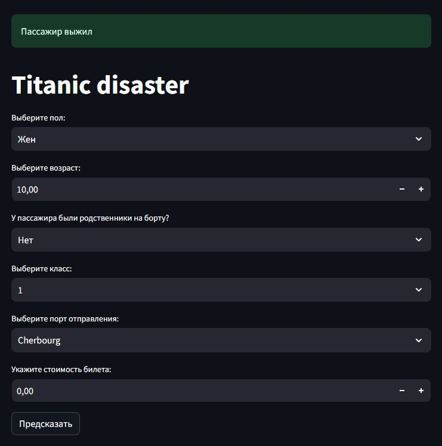

# Titanic_app
Приложение решает задачу предсказания смертности пассажира на борту корабля Титаник
Предсказания делаются на основе указанных вами признаков предобученной моделью машинного обучения CatBoost

Признаки пассажира необходимые для предсказания:
- Пол (gender), integer (0 - Муж, 1 - Жен)
- Возраст (age), float (0.0 - inf)
- Наличие родственников (with_family), integer (0 - Нет, 1 - Да)
- Класс пассажира (pclass), integer (0 - 1, 1 - 2, 2 - 3)
- Порт отправления (embarked), integer (0 - Cherbourg, 1 - Queenstown, 2 - Southampton)
- Стоимость билета (fare), float (0.0 - inf)

Сценарий использования через streamlit:
1. Перейдите по ссылке https://titanicapp-nbei9swylfkszpjpzaunmx.streamlit.app/
2. Укажите запрашиваемые поля
3. Нажмите на кнопку "Предсказать"

Сценарий использования через файл api:
1. Поднять api через uvicorn по адресу 127.0.0.1:8000
2. Отправить запрос содержащий json с информацией о пассажире (Словарь с ключами и значаниями как прописано выше)
3. Считать ответ

Участники:
1. Болкисев Илья Александрович, РИМ-130908
2. Щепин Кирилл Вячеславович, РИМ-130908
3. Соколов Владислав Иванович, РИМ-130908
4. Харлашин Александр Николаевич, РИМ-130908
